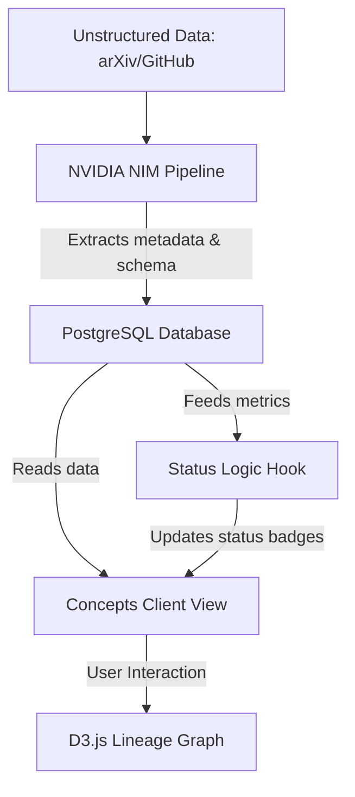

# Data Flow Diagram

```mermaid
graph TD
    A[Unstructured Data: arXiv/GitHub] --> B[NVIDIA NIM Pipeline]
    B -->|Extracts metadata & schema| C[PostgreSQL Database]
    C -->|Reads data| D[Concepts Client View]
    C -->|Feeds metrics| E[Status Logic Hook]
    E -->|Updates status badges| D
    D -->|User Interaction| F[D3.js Lineage Graph]
```

Data flows from ingestion of raw publications, through LLM-based structured extraction, into the relational DB, and finally to the visual frontend interfaces.